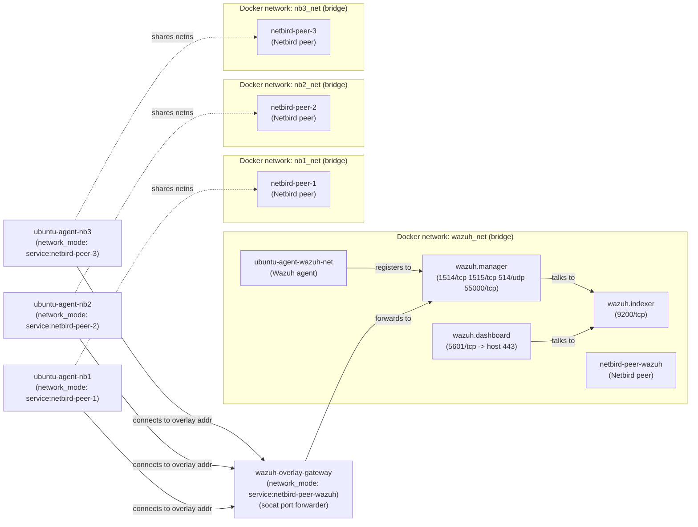

# Wazuh + Netbird Demo

This repo spins up a demo Wazuh stack with Netbird overlay peers and example Ubuntu agents.

## What’s here
- `compose.yml` includes the stack from `wazuh.yml`, `netbird-peers.yml`, `netbird-agents.yml`, and `generate-indexer-certs.yml`.
- `wazuh-agent-ubuntu/` builds a minimal Ubuntu-based Wazuh agent image with a small entrypoint for manager discovery.
- `.env` holds demo values for Netbird setup key and overlay address; supply real values before running.

## Architecture
The stack is split into three logical parts:
- **Wazuh core** (`wazuh.yml`): manager + indexer + dashboard on `wazuh_net`.
- **Netbird peers** (`netbird-peers.yml`): one peer attached to `wazuh_net` (to reach the manager), and three standalone peers.
- **Agents + gateway** (`netbird-agents.yml`): agents either join `wazuh_net` directly or share the network namespace of a Netbird peer; the gateway forwards overlay traffic to the Wazuh manager.

## Goal: Wazuh traffic over Netbird
Goal: ensure a Wazuh agent living “inside” a Netbird peer’s network namespace can reach the Wazuh manager as if it were on the same network.

How it works in this demo:
- `ubuntu-agent-nb1/2/3` set `WAZUH_MANAGER=${WAZUH_OVERLAY_ADDR}` and share the network namespace of `netbird-peer-1/2/3` (`network_mode: service:...`).
- Those agents connect to the Netbird overlay address `WAZUH_OVERLAY_ADDR` on Wazuh ports (1514/tcp, 1515/tcp, 55000/tcp, 514/udp).
- `wazuh-overlay-gateway` shares the network namespace of `netbird-peer-wazuh`, listens on those ports, and forwards them to `wazuh.manager` on the Docker network `wazuh_net`.

Important notes:
- `WAZUH_OVERLAY_ADDR` must be the **Netbird overlay IP of `netbird-peer-wazuh`** (the peer hosting the port-forwarder), not an IP of `wazuh.manager`.
- Netbird ACLs must allow `netbird-peer-1/2/3` to reach `WAZUH_OVERLAY_ADDR` on the forwarded ports.
- `depends_on` does not guarantee Netbird is fully connected before agents start; initial connection attempts may fail until the overlay is up.
- Routing being correct does not guarantee data shows up in Wazuh: agent enrollment/registration is not automated here.
## How this demo mirrors the NetBird pattern
- `netbird-peers` all join one NetBird network using `NB_SETUP_KEY`, so that’s your shared overlay.
- `netbird-peer-wazuh` is the reachable overlay endpoint; it owns the `WAZUH_OVERLAY_ADDR` that agents point at.
- `wazuh.manager`, `wazuh.indexer`, and `wazuh.dashboard` never run NetBird — they stay on the Docker `wazuh_net` and talk to agents only through the overlay gateway.
- `wazuh-overlay-gateway` shares the `netbird-peer-wazuh` namespace and proxy-forwards the Wazuh ports into `wazuh.manager`, acting as the bridge between overlay and private network.
- `ubuntu-agent-nb1/2/3` run inside the NetBird peers’ network namespaces and connect to `WAZUH_OVERLAY_ADDR`, simulating remote workloads behind NAT.

In production you might instead advertise the `wazuh_net` subnet from a routing peer so overlay clients can reach services behind it without per-port forwarding; `socat` is just a minimal stand-in for that bridge in this POC.
## FAQ
1. **Is this Netbird overlay the only option for routing the agents to Wazuh?**
   - No. You could place agents on the same Docker network as the manager, expose the manager ports through existing networks/VPNs, attach the manager directly to Netbird, or use Netbird subnet routing instead of per-port forwarding.
2. **Do I need a different overlay for each additional workload (e.g., `nginx`)?**
   - No. Netbird gives you a single overlay network; you add peers or ACL rules as needed. Within this pattern you can forward many ports through the same gateway. Separate overlays would only be required if you need strict isolation between groups of services.

## Prerequisites
- Docker + Docker Compose V2 (`docker compose` CLI).
- `just` task runner (e.g., `brew install just` or `cargo install just`).
- A Netbird setup key and the overlay IP of `netbird-peer-wazuh`.

## Quickstart
1) Configure environment:
   - Copy `.env` and set `NB_SETUP_KEY` and `WAZUH_OVERLAY_ADDR` to real values.
2) Generate certs (writes to `config/wazuh_indexer_ssl_certs/`):
   - `just certs`
3) Launch the full demo stack:
   - `just up`
4) Check status / logs:
   - `just ps`
   - `just logs`
5) Smoke-test routing:
   - `just test-routing`
5) Tear down:
   - `just down`

## Tasks
- `just certs` — run the Wazuh cert generator.
- `just up` — start the full stack in the background (runs `certs` first).
- `just down` — stop the stack and keep volumes.
- `just logs` — follow combined service logs (tail 200).
- `just ps` — show container status.
- `just test-routing` — verify TCP connectivity to `WAZUH_MANAGER` from the agent containers (does not validate enrollment).

## Known risks (intentionally unmitigated for demo)
- Hardcoded credentials live in `wazuh.yml` environment variables (indexer, API, dashboard), making secrets easy to leak and hard to rotate.
- Netbird peers run with elevated Linux capabilities and `/dev/net/tun`, increasing blast radius if a container is compromised.
- Service startup ordering relies on `depends_on` without healthchecks; agents and gateway can start before dependencies are ready and fail or flap.
- Wazuh and indexer ports are exposed on all interfaces by default, widening the attack surface on shared networks.
- The overlay gateway installs `socat` at container start, adding external package dependency and startup fragility.
- The Wazuh agent package in the custom Ubuntu image is not pinned to a specific version, which can drift from the manager version.

These risks are documented only; the final developer should choose and apply mitigations.
