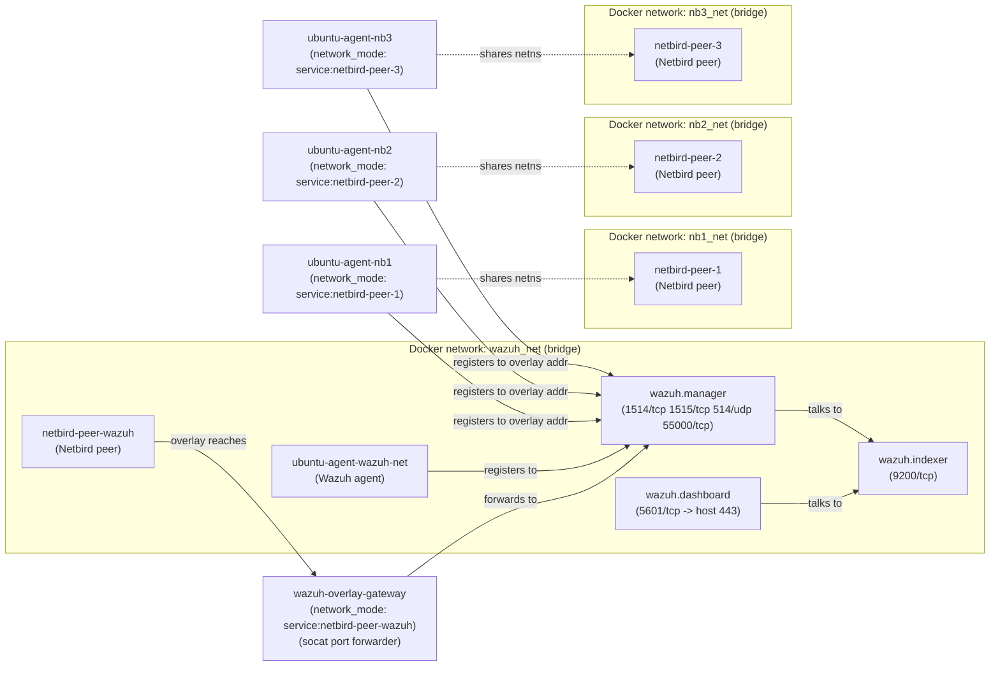

# Wazuh + Netbird Demo

This repo spins up a demo Wazuh stack with Netbird overlay peers and example Ubuntu agents.

## What’s here
- `compose.yml` includes the stack from `wazuh.yml`, `netbird-peers.yml`, `netbird-agents.yml`, and `generate-indexer-certs.yml`.
- `wazuh-agent-ubuntu/` builds a minimal Ubuntu-based Wazuh agent image with a small entrypoint for manager discovery.
- `.env` holds demo values for Netbird setup key and overlay address; supply real values before running.

## Architecture
The stack is split into three logical parts:
- **Wazuh core** (`wazuh.yml`): manager + indexer + dashboard on `wazuh_net`.
- **Netbird peers** (`netbird-peers.yml`): one peer attached to `wazuh_net` (to reach the manager), and three standalone peers.
- **Agents + gateway** (`netbird-agents.yml`): agents either join `wazuh_net` directly or share the network namespace of a Netbird peer; the gateway forwards overlay traffic to the Wazuh manager.

## Prerequisites
- Docker + Docker Compose V2 (`docker compose` CLI).
- `just` task runner (e.g., `brew install just` or `cargo install just`).
- A Netbird setup key and an overlay IP for the Wazuh manager.

## Quickstart
1) Configure environment:
   - Copy `.env` and set `NB_SETUP_KEY` and `WAZUH_OVERLAY_ADDR` to real values.
2) Generate certs (writes to `config/wazuh_indexer_ssl_certs/`):
   - `just certs`
3) Launch the full demo stack:
   - `just up`
4) Check status / logs:
   - `just ps`
   - `just logs`
5) Tear down:
   - `just down`

## Tasks
- `just certs` — run the Wazuh cert generator.
- `just up` — start the full stack in the background (runs `certs` first).
- `just down` — stop the stack and keep volumes.
- `just logs` — follow combined service logs (tail 200).
- `just ps` — show container status.

## Known risks (intentionally unmitigated for demo)
- Hardcoded credentials live in `wazuh.yml` environment variables (indexer, API, dashboard), making secrets easy to leak and hard to rotate.
- Netbird peers run with elevated Linux capabilities and `/dev/net/tun`, increasing blast radius if a container is compromised.
- Service startup ordering relies on `depends_on` without healthchecks; agents and gateway can start before dependencies are ready and fail or flap.
- Wazuh and indexer ports are exposed on all interfaces by default, widening the attack surface on shared networks.
- The overlay gateway installs `socat` at container start, adding external package dependency and startup fragility.
- The Wazuh agent package in the custom Ubuntu image is not pinned to a specific version, which can drift from the manager version.

These risks are documented only; the final developer should choose and apply mitigations.
